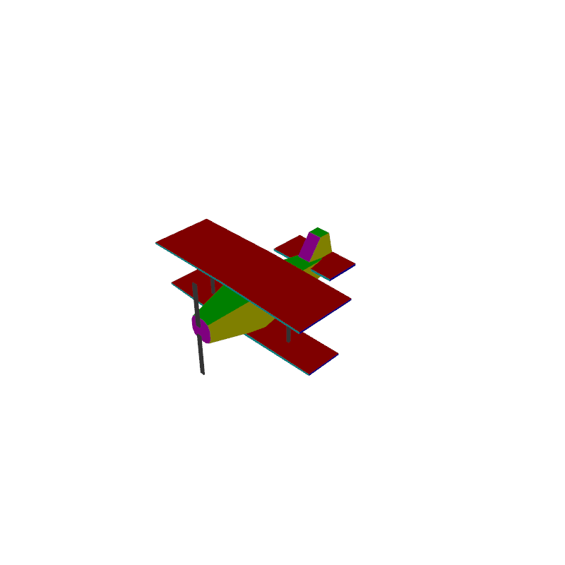

# World War I Airplane Showcase

## Deskripsi
Program pemodelan pesawat sederhana dengan menggunakan _library_ OpenGL. Model pesawat dapat ditampilkan dalam _view_ dari berbagai arah. Selain itu, model pesawat juga dapat dirotasi berdasarkan titik pusatnya. Program dapat menggunakan _shader_ untuk pewarnaan model pesawat.

## Cara Menjalankan Program 

### Instalasi Prerequisite Dependency
```sh
$ sudo apt-get update
$ sudo apt-get install cmake make g++ libx11-dev libxi-dev libgl1-mesa-dev libglu1-mesa-dev libxrandr-dev libxext-dev libxcursor-dev libxinerama-dev libxi-dev
```

### Kompilasi
```sh
$ mkdir build
$ cd build
$ cmake ..
$ make
```

### Run Program
```sh
$ cd src
$ ./main-glfw
```

### Library yang digunakan :
- GLFW (Graphics Library Framework)
- GLEW (OpenGL Extension Wrangler Library)
- GLM  (OpenGL Mathematics)

## Hasil model

#### Model tanpa colour shader


#### Model dengan colour shader


### Operasi yang dapat digunakan :
| Key       | Action                                                                                                                 |
|-----------|------------------------------------------------------------------------------------------------------------------------|
| O         | Zoom Out                                                                                                               |
| P         | Zoom In                                                                                                                |
| W         | Rotate Model Upward                                                                                                    |
| S         | Rotate Model Downward                                                                                                  |
| A         | Rotate Model To The Left                                                                                               |
| D         | Rotate Model To The Right                                                                                              |
| Q         | Rotate Model Counter Clockwise                                                                                         |
| E         | Rotate Model Clockwise                                                                                                 |
| J         | Rotate Kamera mengitari model pada bidang orthogonal Counter Clockwise                                                 |
| L         | Rotate Kamera mengitari model pada bidang orthogonal Clockwise                                                         |
| LEFT_KEY  | Rotate bidang proyeksi dengan memutar vektor yang menunjukkan arah atas  kamera pada bidang proyeksi Counter Clockwise |
| RIGHT_KEY | Rotate bidang proyeksi dengan memutar vektor yang menunjukkan arah atas  kamera pada bidang proyeksi Counter           |
| Z         | Turn On Colour Shader                                                                                                  |
| X         | Turn Off Colour Shader                                                                                                 |
| R         | Reset View                                                                                                             |
| T         | Reset Model                                                                                                            |
| H         | Help Menu                                                                                                              |

## Credits
- 13517057 | Ainun Fitryh Vianiryzki
- 13517066 | Willy Santoso
- 13517075 | Juniardi Akbar

## Referensi
- http://www.opengl-tutorial.org/
- https://learnopengl.com/
- http://www.lighthouse3d.com/tutorials/glut-tutorial/keyboard-example-moving-around-the-world/
- https://open.gl/transformations
